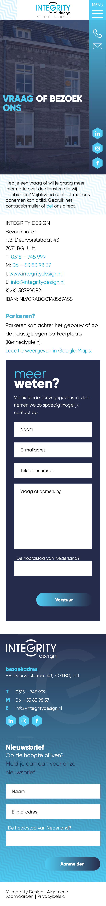

# Procesverslag
Markdown is een simpele manier om HTML te schrijven.  
Markdown cheat cheet: [Hulp bij het schrijven van Markdown](https://github.com/adam-p/markdown-here/wiki/Markdown-Cheatsheet).

Nb. De standaardstructuur en de spartaanse opmaak van de README.md zijn helemaal prima. Het gaat om de inhoud van je procesverslag. Besteedt de tijd voor pracht en praal aan je website.

Nb. Door *open* toe te voegen aan een *details* element kun je deze standaard open zetten. Fijn om dat steeds voor de relevante stuk(ken) te doen.

## Jij

  
uitwerken voor kick-off werkgroep

  ### Auteur:
  Tijn Gerhards

  #### Je startniveau:
  blauw

  #### Je focus:
  responsive design
 

## Mijn Website: Integrity design (internet diensten)

  
uitwerken voor kick-off werkgroep

  ### Je opdracht:
  https://www.integritydesign.nl/wat-is-responsive-webdesign/

  #### Screenshot(s) van de eerste pagina (small screen): 
  Home pagina  
  

  #### Screenshot(s) van de tweede pagina (small screen):
  Projecten - webapplicaties - pagina  
  
 

## Toegankelijkheidstest 1/2 (week 1)

  
uitwerken na test in 1e werkgroep

  ### Bevindingen
  Lijst met je bevindingen die in de test naar voren kwamen: 
  - De website maakt bij het onderdeel contact gebruik van links voor hun tekst, de screenreader stem lijkt deze tekst vervolgens niet te kunnen voorlezen.
  - De screenreader kan afbeeldingen niet lezen.
  - De screenreader pakt geanimeerde inlopende tekst niet.
  - Sommige koppen zijn niet aanwezig
  - Hij leest ook dingen voor zoals "nieuwe regel"
  
  

  #### Screenreader
 Het doorlopen van de website met screenreader ging niet helemaal lekker. Hij las veel dingen voor op de site die overbodig zouden zijn voor de persoon die gebruikt maakt van de screenreader zoals het vertellen van welk tekstelement je bent. Verder kan de screenreader ook de tekst over afbeeldingen niet lezen en mijn site maakt hier veel gebruik van en dus mis je zo veel belangrijk informatie. 

  #### Muis en Toetsenbord 
 Hier heb ik verder niet heelveel op aan te merken. De site is met de muis en het toetsenbord makkelijk te besturen. Alleen wordt de cursor op de site wel anders (vormgeving van de wrebsite zelf)

  #### Motoriek (shocks, elastiekjes)
 Door de elastiekjes kon ik vrijwel niet door de website navigeren. Dingen zoals buttons clicken of naar beneden scrollen waren vrijwel niet te doen.

  #### Visueel (brillen, contrast, kleurenblind, dark/light). 
  Ookal was het beeld met de brillen op wat moeilijker te zien, kon ik mij nogsteeds vrij gemakkelijk door de site navigeren en kon ik de meeste dingen van mijn website nogwel gemakkelijk zien. Dit komt waarschijnlijk door het duidelijke en goeie gebruik van verschillende kleuren op mijn site die zorgen voor een goed contrast.

## Breakdownschets (week 1)

  
uitwerken na afloop 2e werkgroep

  

## Voortgang 1 (week 2)

  
uitwerken voor 1e voortgang

  ### Stand van zaken
  hier dit ging goed & dit was lastig (neem ook screenshots op van delen van je website en code)

----------------

* Dit ging goed - Css in combinatie met html coderen ging goed en website zag er presenteerbaar uit hierdoor.

* Dit ging niet goed - Enters in mijn website tekst krijgen ( maakte gebruik van   element en dat is praktisch niet overzichtelijk en handig voor het functioneren van je website). Verder had ik nog niet een goeie verdeling staan van de verschillende sections waaruit mijn website bestaat. Ook had ik gebruik gemaakt van classes en dat was niet bedoeling van de opdracht.

--------------

  ### Agenda voor meeting
  samen met je groepje opstellen

  | student 1 :

  Website willen laten zien en feedback krijgen op e.v.t de manier van coderen die is toegepast.

  | student 2 :

    Website willen laten zien en feedback krijgen op e.v.t de manier van coderen die is toegepast.

  | student 3 :

    Website willen laten zien en feedback krijgen op e.v.t de manier van coderen die is toegepast.

  | student 4 :

    Website willen laten zien en feedback krijgen op e.v.t de manier van coderen die is toegepast.

  ### Verslag van meeting
  hier na afloop snel de uitkomsten van de meeting vastleggen

- Selection minderen met selection 1,2,3,4,5 etc 
- In css minder font families
- Br weghalen door er nieuwe hoofdstukken van te maken 
- Classes bij sections weghalen 
- Px in css omzetten naar em

## Voortgang 2 (week 3) (Absent vanwege prive omstandigheden)

  
uitwerken voor 2e voortgang

  ### Stand van zaken
  hier dit ging goed & dit was lastig (neem ook screenshots op van delen van je website en code)

  ### Agenda voor meeting
  samen met je groepje opstellen

  | student 1      | student 2          | student 3    | student 4        |
  | ---            | ---                | ---          | ---              |
  | dit bespreken  | en dit             | en ik dit    | en dan ik dat    |
  | en dat ook nog | dit als er tijd is | nog een punt | dit wil ik zeker |
  | ...            | ...                | ...          | ...              |

  ### Verslag van meeting
  hier na afloop snel de uitkomsten van de meeting vastleggen

  - punt 1
  - punt 2
  - nog een punt
- ...

## Toegankelijkheidstest 2/2 (week 4)

  
uitwerken na test in 8e werkgroep

  ### Bevindingen
  Lijst met je bevindingen die in de test naar voren kwamen (geef ook aan wat er verbeterd is):

  #### Screenreader
  Hier korte omschrijving (met indien nodig afbeeldingen)

  Hier een omschrijving van hoe het opgelost kan worden (met indien nodig afbeeldingen)

  #### Muis en Toetsenbord 
  Hier korte omschrijving (met indien nodig afbeeldingen)

  Hier een omschrijving van hoe het opgelost kan worden (met indien nodig afbeeldingen)

  #### Motoriek (shocks, elastiekjes)
  Hier korte omschrijving (met indien nodig afbeeldingen)

  Hier een omschrijving van hoe het opgelost kan worden (met indien nodig afbeeldingen)

  #### Visueel (brillen, contrast, kleurenblind, dark/light). 
  Hier korte omschrijving (met indien nodig afbeeldingen)

  Hier een omschrijving van hoe het opgelost kan worden (met indien nodig afbeeldingen)

## Voortgang 3 (week 4)

  
uitwerken voor 3e voortgang

  ### Stand van zaken
  hier dit ging goed & dit was lastig (neem ook screenshots op van delen van je website en code)

  ### Agenda voor meeting
  samen met je groepje opstellen

  | student 1      | student 2          | student 3    | student 4        |
  | ---            | ---                | ---          | ---              |
  | dit bespreken  | en dit             | en ik dit    | en dan ik dat    |
  | en dat ook nog | dit als er tijd is | nog een punt | dit wil ik zeker |
  | ...            | ...                | ...          | ...              |

  ### Verslag van meeting
  hier na afloop snel de uitkomsten van de meeting vastleggen

  - punt 1
  - punt 2
  - nog een punt
  - ...

## Eindgesprek (week 5)

  
uitwerken voor eindgesprek

  ### Je uitkomst - karakteristiek screenshots:
  

  ### Dit ging goed/Heb ik geleerd: 
  Korte omschrijving met plaatjes

  

  ### Dit was lastig/Is niet gelukt:
  Korte omschrijving met plaatjes

  

## Bronnenlijst

  
continu bijhouden terwijl je werkt

  Nb. Wees specifiek ('css-tricks' als bron is bijv. niet specifiek genoeg).

  1. bron 1
  2. bron 2
  3. ...

